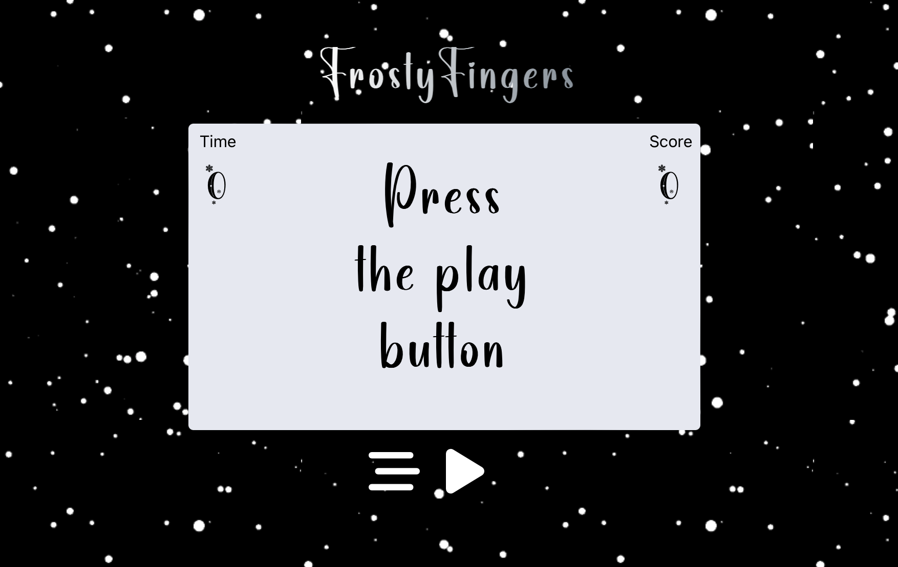

# FrostyFingers

[Click Here](https://matineno.github.io/frosty-fingers/) to test.

## Description
FrostyFingers is a fast-paced word game where players race against the clock to find as many words as possible within a given time limit.

## Features
- Timer: Race against time to find words before the clock runs out.
- Word Validation: Validate words entered by the player against a dictionary.
- Score Tracking: Keep track of the player's score based on the words found.
- Difficulty Levels: Choose from multiple difficulty levels to challenge yourself. (Coming Soon)
- Leaderboard: Compete with other players and climb the leaderboard. (Coming Soon)

## Screenshots

## How to Play
1. Start the game by clicking the "Play" button.
2. Enter words into the input field, words validate automaticallu if correct.
3. The timer will countdown, and your score will increase for each valid word found.
4. Keep playing until time runs.

## Contributing
Contributions are welcome! Please fork the repository and submit a pull request.

## License
This project is licensed under the MIT License - see the [LICENSE](LICENSE) file for details.
